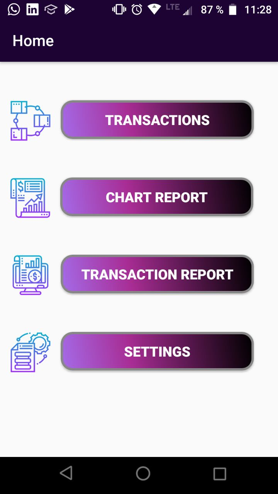

# Money-control-Application
Android application for personal budget management

This is a colaborative project developed for the Otto Von Gerike University which had the following goals

- Get familiar with the development of Android applications using the IDE of Android Studio.
- Interiorize Agile software development skills inside a colaborative team; interacting through development tools like Github and also team tools like slak, Asana and trello.
- Improve skills for writting, administration and development of User stories.
- Develop a budget control application.
- Improve user friendly development skills.
- Clean software development.

**The application content:**

The app developed consists of several interactive and self explanatory interfaces, such as:

- Home panel:

- Transaction introduction interface:

- Report of transactions:

- Financial graphic reports:

- Settings:

